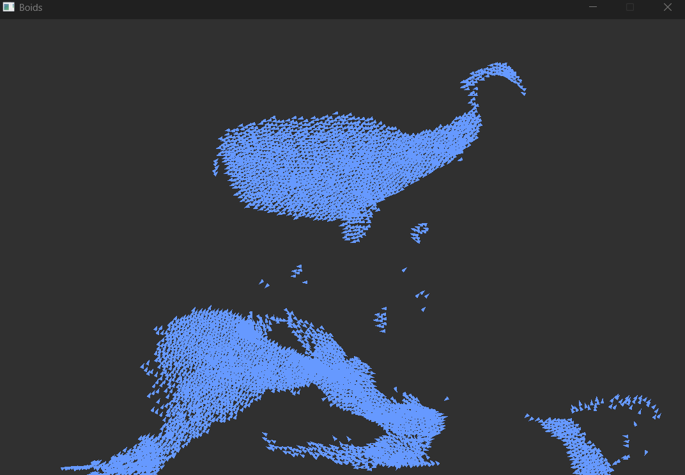

# Boids

Project for the "Parallel Programming" course focusing on how much we can speed up a program by parallelizing it with OpenMP.

## About the Program

The boids is a simple simulation of flocking behavior based on 3 rules:
+ alignment: nearby boids should fly in the same direction;
+ coherence: nearby boids should keep themselves around their center of mass;
+ danger: nearby boids should distance themselves in order not to bump into each other.

In addition to these I implemented 2 additional rules:
+ velocity clamping: the velocity of each boid should be in a certain range;
+ turning: when a boid gets too close to the border of the window it starts turning.



## How to Build

**IMPORTANT**\
If you are not using MSVC to compile the code you have to add to [CMakeList](CMakeLists.txt) your compiler options.\
Your code should look like this:
```cmake
if (<MY_COMPILER>)
    set(CMAKE_CXX_FLAGS_RELEASE <FLAGS_TO_COMPILE_FOR_SPEED>)

    if (USE_OPENMP)
        target_compile_options(Boids PRIVATE <FLAG_TO_ACTIVATE_OPENMP>)
    endif()
endif()
```

1. Create a folder called "lib" in the root folder
2. Download SDL3 and put it into the "lib" folder renaming it "SDL"\
(the program was tested with SDL 3.2.24)
3. Build with CMake
(you can decide whether to enable or disable OpenMP)
(make sure to build in "Release" mode, how to do it depends on which generator you use)
```sh
cmake -B build -DUSE_OPENMP=<ON/OFF>
cmake --build build
```


## How to Run

To run the program with the default settings just run it (make sure there is the [settings](settings.txt) file in the folder
together with the executable, otherwise just copy it in).

To run the program with custom settings either modify the "settings.txt" found  in the executable folder
or run the program in the command line using as argument the path to your settings.

```sh
Boids.exe path\to\my\settings.txt
```

## Settings

The program reads its settings from file.

You can specify in the file:
+ the number of boids to simulate with "POPULATION \<number>";
+ the number of frames to render with "MAXRUN \<number>", with 0 meaning no limit
(you can stop the simulation either by closing the window or pressing "esc");
+ the number of threads to use with "THREADS \<number>";
+ the number of iterations to assign at once with "NEIGHBORLOOPCHUNKSIZE \<number>".
This is valid only for the loop calculating the coherence, alignment and danger rules;
+ the window size and its color with "WINDOW \<width\> \<height\> \<r\> \<g\> \<b\>",
  where "r","g" and "b" are the red, blue and green channels specified as integers from 0 to 255;
+ to disable VSync with "NOVSYNC";
+ the size and color of boids with "BOIDS \<length> \<width> \<r> \<g> \<b>",
where "r", "g" and "b" are the color channels specified as float ranging from 0 to 1;
+ the minimum and maximum boids velocities with "VELOCITY \<min> \<max>";
+ the visibility and danger ranges with "RANGES \<visible> \<danger>";
+ the danger factor with "DANGER \<factor>";
+ the alignment factor with "ALIGNMENT \<factor>";
+ the cohesion factor with "COHESION \<factor>";
+ the distance from the border at which the boids will start turning with "MARGIN \<distance>";
+ the turning speed with "TURN \<speed>".

All distances are to be expressed in pixel.\
All velocities are to be expressed in pixel/second.\
If a line starts with "#" the program will skip it.

[settings](settings.txt) provide an example of settings file.